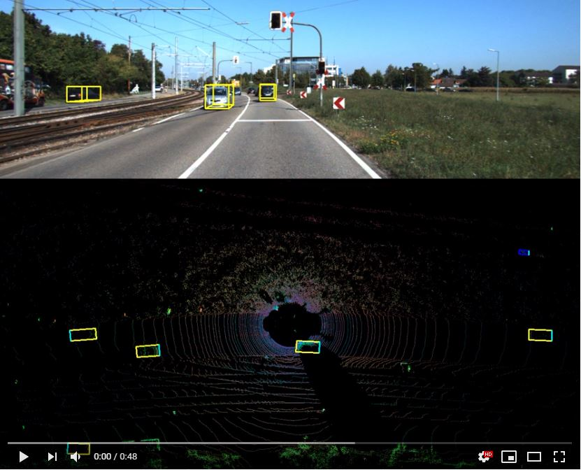
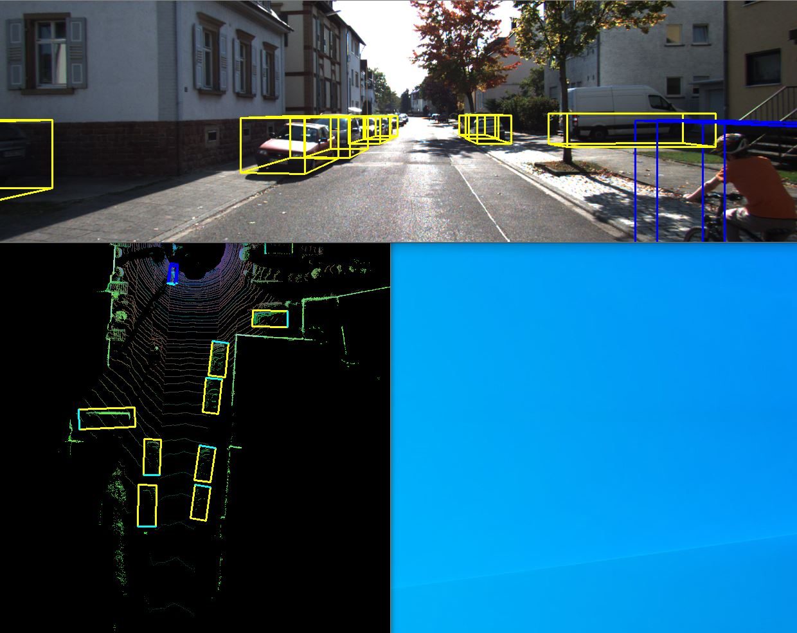
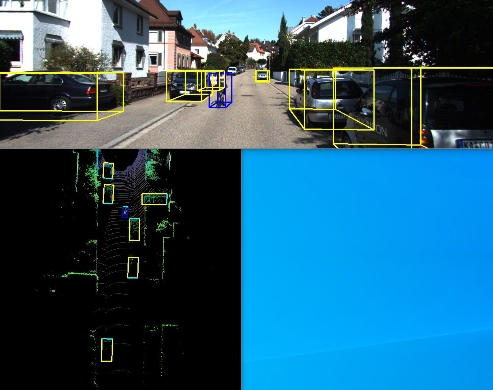

# Complex-YOLO-V3
Complete but Unofficial PyTorch Implementation of [Complex-YOLO: Real-time 3D Object Detection on Point Clouds](https://arxiv.org/pdf/1803.06199.pdf) with YoloV3

## Installation
#### Clone the project and install requirements
    $ git clone https://github.com/ghimiredhikura/Complex-YOLO-V3
    $ cd Complex-YOLO-V3/
    $ sudo pip install -r requirements.txt

## Quickstart

#### Download pretrained weights 
    $ cd checkpoints/
    $ python download_weights.py
    
#### Test [without downloading dataset] 

    1. $ python test_detection.py --split=smaples --folder=sampledata  
    2. $ python test_both_side_detection.py --split=smaples --folder=sampledata

#### Demo Video
[](https://www.youtube.com/watch?v=JzywsbuXFOg)

## Data Preparation

You can see `sampledata` folder in `data/KITTI/dataset` directory which can be used for testing this project without downloading KITTI dataset. However, if you want to train the model by yourself and check the mAP in validation set just follow the steps below.

#### Download the [3D KITTI detection dataset](http://www.cvlibs.net/datasets/kitti/eval_object.php?obj_benchmark=3d) 
1. Camera calibration matrices of object data set (16 MB)
2. Training labels of object data set (5 MB)
3. Velodyne point clouds (29 GB)
4. Left color images of object data set (12 GB)

Now you have to manage dataset directory structure. Place your dataset into `data` folder. Please make sure that you have the dataset directory structure as follows. 

```
└── data/KITTI/object
       ├── training    <-- 7481 train data
       |   ├── image_2 <-- for visualization
       |   ├── calib
       |   ├── label_2
       |   ├── velodyne
       └── testing     <-- 7580 test data
           ├── image_2 <-- for visualization
           ├── calib
           ├── velodyne           
```

The `train/valid` split of training dataset as well as `sample` and `test` dataset ids are in `data/KITTI/ImageSets` directory. From training set of 7481 images, 6000 images are used for training and remaining 1481 images are used for validation. The mAP results reported in this project are evaluated into this valid set with custom mAP evaluation script with 0.5 iou for each object class. 

#### Verify your download
    $ python check_dataset.py

## Train
    $ train.py [-h] [--epochs EPOCHS] [--batch_size BATCH_SIZE]
                [--gradient_accumulations GRADIENT_ACCUMULATIONS]
                [--model_def MODEL_DEF] 
                [--pretrained_weights PRETRAINED_WEIGHTS] 
                [--n_cpu N_CPU] [--img_size IMG_SIZE]
                [--evaluation_interval EVALUATION_INTERVAL]
                [--multiscale_training MULTISCALE_TRAINING]

--Training log example--

    ---- [Epoch 0/300, Batch 250/1441] ----  
    +------------+--------------+--------------+--------------+  
    | Metrics    | YOLO Layer 0 | YOLO Layer 1 | YOLO Layer 2 |  
    +------------+--------------+--------------+--------------+  
    | grid_size  | 17           | 34           | 68           |  
    | loss       | 6.952686     | 5.046788     | 4.256296     |  
    | x          | 0.054503     | 0.047048     | 0.060234     |  
    | y          | 0.110871     | 0.059848     | 0.081368     |
    | w          | 0.101059     | 0.056696     | 0.022349     |
    | h          | 0.294365     | 0.230845     | 0.076873     |
    | im         | 0.215230     | 0.218564     | 0.184226     |
    | re         | 1.049812     | 0.883522     | 0.783887     |
    | conf       | 4.682138     | 3.265709     | 2.941420     |
    | cls        | 0.444707     | 0.284557     | 0.105938     |
    | cls_acc    | 67.74%       | 83.87%       | 96.77%       |
    | recall50   | 0.000000     | 0.129032     | 0.322581     |
    | recall75   | 0.000000     | 0.032258     | 0.032258     |
    | precision  | 0.000000     | 0.285714     | 0.133333     |
    | conf_obj   | 0.058708     | 0.248192     | 0.347815     |
    | conf_noobj | 0.014188     | 0.007680     | 0.010709     |
    +------------+--------------+--------------+--------------+
    Total loss 16.255769729614258
    ---- ETA 0:18:27.490254

## Test
    $ python test_detection.py
    $ python test_both_side_detection.py

## Evaluation
    $ python eval_mAP.py 

mAP (min. 50 IoU)

| Model/Class             | Car     | Pedestrian | Cyclist | Average |
| ----------------------- |:--------|:-----------|:--------|:--------|
| Complex-YOLO-v3         | 97.89   |82.71       |90.12    |90.24    |
| Complex-Tiny-YOLO-v3    | 95.91   |49.29       |78.75    |74.65    |

#### Results 
<p align="center"></p>
<p align="center"></p>
<p align="center"></p>

## Credit

1. Complex-YOLO: https://arxiv.org/pdf/1803.06199.pdf

YoloV3 Implementation is borrowed from:
1. https://github.com/eriklindernoren/PyTorch-YOLOv3

Point Cloud Preprocessing is based on:  
1. https://github.com/skyhehe123/VoxelNet-pytorch
2. https://github.com/dongwoohhh/MV3D-Pytorch
